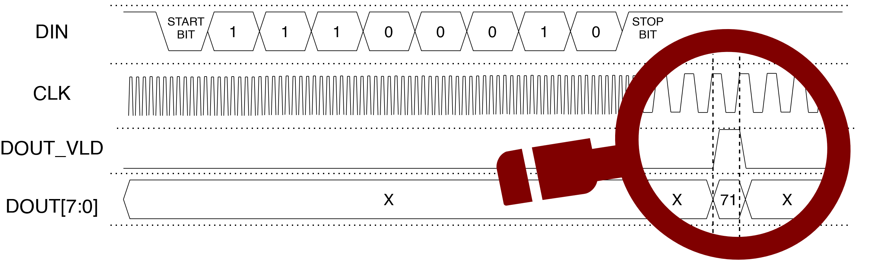
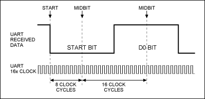

# PART 1 [ Zadaní | CZ ]
## Vytvořte technickou zprávu, která bude obsahovat:

 - Jméno, příjmení a login.
 - Schéma architektury navrženého obvodu UART_RX na úrovni RTL a její stručný popis.
 - Nákres grafu přechodů konečného automatu a jeho stručný popis.
 **[Technicka zpráva, příklad](https://wis.fit.vutbr.cz/FIT/st/cwk.php.cs?title=Prvn%ED_%E8%E1st_projektu_%28N%E1vrh_obvodu%29&src=Priloha1.pdf&ns=INC&action=download&csid=779591&id=14668)**
## Vstupní tok dat
- Start bit  
- 8 bitů dat  
- End bit  
- CLK bude pracovat 16x vyšší ve srovnaní přenosovou rychlosti  
## Porty
**DIN** - přijímá jednotlivé bity, provede jejich de-serializaci
**DOUT** - výsledné 8-bitové slovo zapíše na datový port DOUT
**DOUT_VLD** - Platnost datového slova na portu DOUT potvrďte nastavením příznaku na úroveň logické 1 po dobu jednoho taktu hodinového signálu CLK

>Jednotlivé části datové cesty obvodu bude potřeba ovládat skrze konečný automat (Finite State Machine). Sestavte si nejprve graf přechodů tohoto automatu.

>Při návrhu nezapomeňte ošetřit asynchronní vstup do synchronní sítě obvodu UART_RX pro redukci možných metastabilních stavů.
## Asynchronní sériová komunikace
- Asynchronní sériová komunikace se stala základním způsobem přenosu dat mezi počítači a periferními zařízeními. V současné době se používá zejména v oblasti vestavěných systémů. **Pro přenos dat mezi dvěma uzly stačí při sériové komunikaci jeden datový vodič**, po kterém jsou postupně zasílány jednotlivé datové bity. Asynchronnost komunikace pak znamená, **že přenášené bity nejsou synchronizovány žádným dodatečným signálem jako je např. hodinový signál CLK**. Přijímač je schopen rozpoznat příchozí bity a jejich synchronizaci na základě použitého zakódování na datovém vodiči.

- Komunikační linka (vodič) je vždy **před začátkem přenosu libovolného vícebitového slova** (obvykle bajtu) nastavena na úroveň logické 1. Přenos vícebitového slova pak začíná tzv. START bitem s hodnotou logické 0. Odvysílání `START` bitu, tedy přechod datové linky z hodnoty logické 1 do 0, umožní přijímači spolehlivě identifikovat okamžik začátku přenosu.

- Za `START` bitem jsou následně odvysílány jednotlivé bity datového slova **od významově nejnižšího bitu (LSB) po významově nejvyšší bit (MSB)**. Za posledním bitem datového slova následuje jeden nebo více tzv. **STOP** bit, které jsou vždy nastaveny na úroveň logické 1.

- Za `STOP` bitem může začít přenos dalšího datového slova, začíná se opět `START` bitem. Všimněte si, že `STOP` bit předchozího datového slova v kombinaci se `START` bitem dalšího slova umožňují spolehlivou detekci začátku nového přenosu (přechod z log. 1 do 0).

- Pro spolehlivé rozpoznání jednotlivých bitů přenášeného datového slova na straně přijímače je potřeba nejen identifikovat začátek přenosu (přechod z logické 1 do 0), ale také vědět na jaké rychlosti komunikace probíhá. Vysílač i přijímač se proto musí nejprve nastavit na stejnou přenosovou rychlost.

- Přenosová rychlost se udává v počtu přenesených baudů za sekundu, **přičemž jeden baud odpovídá v tomto případě jednomu bitu**. Základní a také nejčastěji používanou přenosovou rychlostí je rychlost 9600 baudů za sekundu. Pokud uvažujeme přenos 8-bitových datových slov ohraničených jedním `START` bitem a alespoň jedním `STOP` bitem (celkem 10 bitů), potom jsme schopni na rychlosti 9600 baudů přenášet až 960 bajtů za sekundu (9600/10).

- Aby přijímač spolehlivě identifikoval hodnoty (logické úrovně) přenášených datových bitů je navíc doporučeno, aby tento obvod pracoval na **16x větší frekvenci**, než je vybraná přenosová rychlost. Každý datový bit by následně měl být snímán uprostřed časového intervalu pro přenos bitů, jak je naznačeno na obrázku 3. Specifikace doporučuje při 16x větší vzorkovací frekvenci snímat logickou úroveň vstupních dat v 7., 8. a 9. hodinovém cyklu a jako výsledný bit použít majoritu z těchto tří hodnot. Pro jednoduchost se však zde spokojme s hodnotou nasnímanou na konci 8. hodinového cyklu označenou jako `MIDBIT`.

